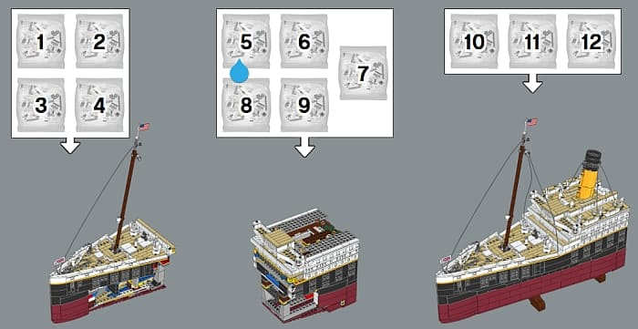
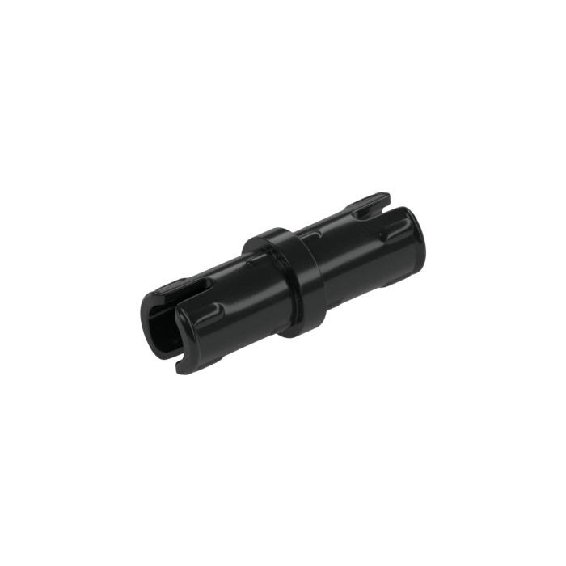

After finishing two third of Manoa RoomieMatch and getting to know design pattern, I learned that I have been using and implementing this concept without realizing. Recognizing these patterns and strategies that me and my team has been using strengthen my awareness for future development, as this also helps me understand the structure our website more, making it easier to spot bugs or errors.

## Component-Based Architecture

One of the most common pattern in our website is Component-Based Architecture. Instead of writing a huge HTML file to display componenents of the website, we break the UI down into many different parts that operates independently. To think of this, I think of my process of building big LEGO sets. Sometimes, when the set is too big, such as the Titanic or Star Wars gigantic spacecrafts, there are many small manuals provided. These small manuals help and allow builders to assemble little parts bits by bits first to avoid overwhelming and confusion before putting them all together into a final result. Our website works the same, as there is a seperate file to build each component on the page, such as for the navigation bar, the footer, and each match cards. By breaking into smaller components, editors like me and my teamates can make adjustments that are easier to manage and safer to change without seriously affect other part of the page. This approach does not only make the the code cleaner and easier for someone else to look at, it is also more organized and scalable, especially when the website and its functionalities improve.

Another instance of Component-Based Architecture in Manoa RoomieMatch is that the Button component. This button appears and used in most of the pages (Sign In, Sign up, Submit Survey, ect). This component is reusable, as if the style of the button is changed in the global.css file, the shape and display of it would change and update in other pages as well.

  

## Repository/Service Pattern

A really useful and important file in our website's program is the dbAction.ts. This acts like the "middle man" between the UI components and the database. This file provides a layer of protection and convinience when the components are trying to talk and fetch data from the database's tables. These components do not "know" if the website is using MongoDB or Prisma or PostgreSQL, the only know that they call a function, such as CreateUser for the Sign Up page. This means that if the group switches to another database later on, we only need to rewrite and adjust the dbAction.ts file, not all the UI elements on the pages, making these interface components reusable despite the changes in database. This extra layer of security can be also seen as the bridge between the two different aspect of the website, ensuring that these queries never run on the browser directly, only on the secure server of the group.

In the context of LEGO building, I see this pattern as the LEGO Friction Ridge that are usually seen and used in Mechanic and Technic sets as well as robots in Robotic Competition. This piece is the the "glue" of a set, where it helps connects different parts together. If one of the part needs adjustment, the builder can simply remove that single piece connected by the Friction Ridge without taking apart the entire model. In this same way, the dbAction.ts serves as the connection between the interface and the database, and if either of these change, developers/editors only need to change the "bridge".

  

## Conclusion

Through the Manoa RoomieMatch project, I learned and understood that design patterns are reusable components and solutions to common issues or problem that usually come up in web development. By applying these patterns, the structure of the website is broken down to be more organized, easier to understood, adjusted, and maintained, especially when the project is shared among a group of people. Understanding and recognizing these patterns helped me to be more aware of the website's stucture and functionality, as this knowledge will help me to develop cleaner, more scalable, and better for future improvements of Manoa RoomieMatch.

